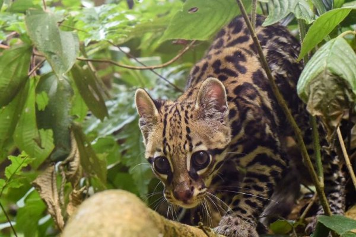

---
title: "Generalized Linear Model"
output:
    html_document:
      toc: true
      toc_float: true 
      toc_depth: 2
---   
<style>
  h1{font-size: 35px !important;
    color: #000000 !important;
    border-style: solid;
    border-color: #000000;
    background-color: #FFFFFF;
    text-align: center;
    margin-top: 5px;
  }
</style>  
<style>
  h2{font-size: 35px !important;
    color: #d62d20 !important;
    background-color: #FFFFFF;
    text-align: center;
    margin-top: 5px;
  }
</style>  


<h1> Summary of the method </h1>

Blabla    
Blabla   


  
Blabla   
Blabla   
Blabla   
Blabla   

More comprehensive details can be found [HERE](https://www.google.fr/).       
<br>    
   
<h1> Code </h1>   
<br>    
<h2>Random tree</h2>

### {.tabset .tabset-fade .tabset-pills}      

#### Y is continuous  

**Parameters to consider**        
  
*    Parameter 1: level of blabla bla.    
*    Parameter 2: other think.   

**Summary of the different steps**  
  
*    Do the thing 1    
*    Do the thing 2    
*    Do the thing 3    

**Step 1: the thing**   
Blablabla   
Blablabla   
Blablabla      

```{r}
a <- 1+1
a *2
```


***   

**Step 2: other thing**   
Blablabla   
Blablabla   
Blablabla    

```{r}
a <- 1+1
a *2
```


***   

**Step 3: last thing**   
Blablabla   
Blablabla   
Blablabla    

```{r}
a <- 1+1
a *2
```


***   
  
#### Y is binary   

**Parameters to consider**        
  
*    Parameter 1: beware of ducks.    
*    Parameter 2: other think.   

**Summary of the different steps**  
  
*    Do the thing 1    
*    Do the thing 2    
*    Do the thing 3    

**Step 1: the thing**   
Blablabla   
Blablabla   
Blablabla      

```{r}
a <- 1+1
a *2
```


***   

**Step 2: other thing**   
Blablabla   
Blablabla   
Blablabla    

```{r}
a <- 1+1
a *2
```


***   

**Step 3: last thing**   
Blablabla   
Blablabla   
Blablabla    

```{r}
a <- 1+1
a *2
```


***   
  
#### Y is a count data    
  
**Parameters to consider**        
  
*    Parameter 1: level of blabla bla.    
*    Parameter 2: other think.   

**Summary of the different steps**  
  
*    Do the thing 1    
*    Do the thing 2    
*    Do the thing 3    

**Step 1: the thing**   
Blablabla   
Blablabla   
Blablabla      

```{r}
a <- 1+1
a *2
```


***   

**Step 2: other thing**   
Blablabla   
Blablabla   
Blablabla    

```{r}
a <- 1+1
a *2
```


***   

**Step 3: last thing**   
Blablabla   
Blablabla   
Blablabla      

```{r}
a <- 1+1
a *2
```


***                   
###       
<h2> Random tree with CV</h2>

### {.tabset .tabset-fade .tabset-pills}

#### Y is continuous
**Parameters to consider**        
  
*    Parameter 1: level of blabla bla.    
*    Parameter 2: other think.   

**Summary of the different steps**  
  
*    Do the thing 1    
*    Do the thing 2    
*    Do the thing 3    

**Step 1: the thing**   
Blablabla   
Blablabla   
Blablabla      

```{r}
a <- 1+1
a *2
```


***   

**Step 2: other thing**   
Blablabla   
Blablabla   
Blablabla    

```{r}
a <- 1+1
a *2
```


***   

**Step 3: last thing**   
Blablabla   
Blablabla   
Blablabla    

```{r}
a <- 1+1
a *2
```


***   
  
#### Y is binary   

**Parameters to consider**        
  
*    Parameter 1: beware of ducks.    
*    Parameter 2: other think.   

**Summary of the different steps**  
  
*    Do the thing 1    
*    Do the thing 2    
*    Do the thing 3    

**Step 1: the thing**   
Blablabla   
Blablabla   
Blablabla      

```{r}
a <- 1+1
a *2
```


***   

**Step 2: other thing**   
Blablabla   
Blablabla   
Blablabla    

```{r}
a <- 1+1
a *2
```


***   

**Step 3: last thing**   
Blablabla   
Blablabla   
Blablabla    

```{r}
a <- 1+1
a *2
```


***   
  
#### Y is a count data    
  
**Parameters to consider**        
  
*    Parameter 1: level of blabla bla.    
*    Parameter 2: other think.   

**Summary of the different steps**  
  
*    Do the thing 1    
*    Do the thing 2    
*    Do the thing 3    

**Step 1: the thing**   
Blablabla   
Blablabla   
Blablabla     

```{r}
a <- 1+1
a *2
```


***    

**Step 2: other thing**   
Blablabla   
Blablabla   
Blablabla    

```{r}
a <- 1+1
a *2
```


***   

**Step 3: last thing**   
Blablabla   
Blablabla   
Blablabla     

```{r}
a <- 1+1
a *2
```
***       
###
<h2> Random tree with k-fold CV</h2>

### {.tabset .tabset-fade .tabset-pills}

#### Y is continuous
**Parameters to consider**        
  
*    Parameter 1: level of blabla bla.    
*    Parameter 2: other think.   

**Summary of the different steps**  
  
*    Do the thing 1    
*    Do the thing 2    
*    Do the thing 3    

**Step 1: the thing**   
Blablabla   
Blablabla   
Blablabla     

```{r}
a <- 1+1
a *2
```


***    

**Step 2: other thing**   
Blablabla   
Blablabla   
Blablabla    

```{r}
a <- 1+1
a *2
```


***   

**Step 3: last thing**   
Blablabla   
Blablabla   
Blablabla    

```{r}
a <- 1+1
a *2
```


***   
  
#### Y is binary   

**Parameters to consider**        
  
*    Parameter 1: beware of ducks.    
*    Parameter 2: other think.   

**Summary of the different steps**  
  
*    Do the thing 1    
*    Do the thing 2    
*    Do the thing 3    

**Step 1: the thing**   
Blablabla   
Blablabla   
Blablabla     

```{r}
a <- 1+1
a *2
```


***    

**Step 2: other thing**   
Blablabla   
Blablabla   
Blablabla   

```{r}
a <- 1+1
a *2
```


***    

**Step 3: last thing**   
Blablabla   
Blablabla   
Blablabla    

```{r}
a <- 1+1
a *2
```


***   
  
#### Y is a count data    
  
**Parameters to consider**        
  
*    Parameter 1: level of blabla bla.    
*    Parameter 2: other think.   

**Summary of the different steps**  
  
*    Do the thing 1    
*    Do the thing 2    
*    Do the thing 3    

**Step 1: the thing**   
Blablabla   
Blablabla   
Blablabla   

```{r}
a <- 1+1
a *2
```


***       
**Step 2: other thing**   
Blablabla   
Blablabla   
Blablabla    

```{r}
a <- 1+1
a *2
```


***   
**Step 3: last thing**   
Blablabla   
Blablabla   
Blablabla   

```{r}
a <- 1+1
a *2
```


***   