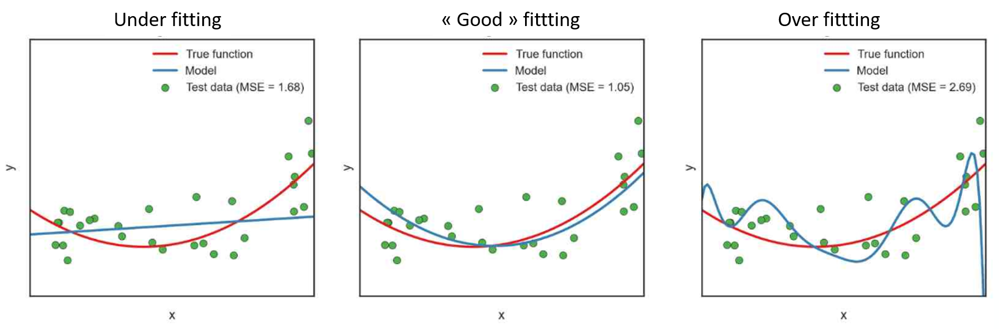
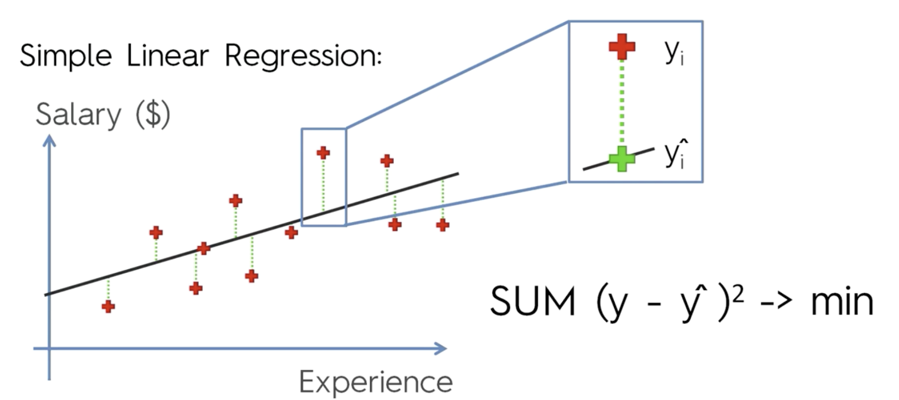

## Regularization

### Introduction
We would like to predict the quantity $Y$ using the explicative variable $X$. One solution could be to fit the following linear model: 

$Y = f(X) + e$

Linear models can be prone to overfitting, i.e. these models will have perfect accuracy on the training data, but will perform poorly on unseen data. 

\newline

 
Let's take an extreme example to illustrate why this happens. We have 100 observations in our training dataset. Let's say we also have 100 features. If we fit a linear regression model with all of those 100 features, each coefficient would simply memorize one observation. 

In other words, we only memorized the noise in the training data, not the general pattern of the data. The predictive accuracy of this model will be low. 
Secondly, several explicative variables can be linearly related (multicollinearity), which can result in unstable estimation of parameter values. 

To address these issues, we can *artificially penalize model coefficients* in order to reduce (i.e. shrink) the coefficient values towards zero. This allows the less contributive variables to have a coefficient close to zero or equal zero. This refers to *regularization*, also called penalization or shrinkage.

\newline
**How is it done in practice?** 
\newline
In linear regression, the coefficient $beta$ is estimated by ordinary least square method (OLS), which consists in minimizing the sum of the squares of the differences between the observed dependent variable (values of the variable being observed) in the given dataset and those predicted by the linear function of the independent variable. Basically, the purpose is to minimize the quantity: 

$\sum  (Y - X * \beta) ^ 2$. 

See here a schematic representation of OLS: \newline

 

\newline
In regularization, a “constraint” $P$ is added in the equation: 
$\sum (Y - X * \beta) ^ 2 + P$ 

The more $P$ increases, the lowest the coefficient estimate will be. 
See here a schematic representation of penalized fit. Red dots represent the training data and green dots are the test data. \newline

Three forms of $P$ exist: 

- $\lambda * \sum \beta^2$, corresponding to Ridge regression

- $\lambda * \sum | \beta |$, corresponding to Lasso regression

- $\lambda_1 * \sum | \beta | + \lambda_2 * \sum \beta^2$, corresponding to Elastic-Net regression, which is the generalization of Ridge and Lasso regressions. 

The amount of shrinkage is determined by the parameter \lambda (or $\lambda_1$ and $\lambda_2$ in Elastic-Net regression). The aim is to determine the best possible $\lambda$ value, i.e. that which minimizes the error resulting from the adjustment of the parameters. This is done using cross-validation (see the code section).

There’s no "best" type of penalty. It really depends on the dataset and the question. It is recommended to try different algorithms that use a range of penalty strengths as part of the tuning process, which is more details in the code section.

Note: $\lambda$, $\lambda_1$, $\lambda_2$ >= 0. If $\lambda$ = 0 or $\lambda_1$ = $\lambda_2$ = 0, then we obtain the sum of least squared, corresponding to OLS. 

### Ridge regression

In Ridge regression, the best fit is found by minimizing the quantity: 

$\sum (Y - X * \beta) ^ 2 + \lambda * \sum \beta^2$ 

This method tends to shrink all coefficients, which means that all variables are retained in the model. The higher the penalty $\lambda$, the more biased the coefficients:

- if $\lambda$ tends towards 0, then we tend to a similar situation to a model estimated by OLS ($\beta$RIDGE --> $\beta$ linear regression). 

- $\lambda$ tends towards infinity, then the value of the coefficients tends towards 0. 
Thus, selecting a good value for $\lambda$ is critical. It can be done using cross-validation. 

\newline
Note: In contrast to linear regression, ridge regression is highly affected by the scale of the explicative variables. Therefore, it is better to standardize the explicative variables before applying the ridge regression, so that they are all on the same scale.

\newline
Note 2: Ridge regression tends to give the same value of coefficients to correlated variables. 

\newline
Summary:

- Ridge regression penalizes the squared size of coefficients.

- Practically, this leads to smaller coefficients, but it doesn't force them to 0.

- In other words, Ridge offers feature shrinkage.

- The "strength" of the penalty should be tuned.

- A stronger penalty leads to coefficients pushed closer to zero, but it will not set any of them exactly to zero, which will produce non parsimonious models. 
The Lasso regression is an alternative that overcomes this drawback.

### Lasso regression

Lasso, or LASSO, stands for Least Absolute Shrinkage and Selection Operator. In the case of Lasso regression, the best fit is found by minimizing the quantity: 

$\sum (Y - X * \beta) ^ 2 + \lambda * \sum | \beta |$

As a result of taking the absolute value instead of the squared parameters, the penalty forces the coefficient estimates with a minor contribution to the model to be exactly equal to zero. Lasso can be also seen as an alternative to the subset selection methods for performing variable selection in order to reduce the complexity of the model.

A higher value of \lambda, i.e. a higher amount of shrinkage, leads to more null coefficients. If $\lambda$ tends towards infinity, all coefficients are forced to zero. On the contrary, if \lambda = 0, then the estimated coefficients will correspond to those estimated by OLS (i.e. \beta_Lasso = \beta_OLS). The value of \lambda is tunable and the optimal amount of shrinkage can be found using cross-validation (see code section).

One advantage of Lasso regression over Ridge regression, is that it produces more parsimonious and more interpretable models, as it incorporates only a reduced set of the variables. Generally, Lasso might perform better in a situation where some of the variables have large coefficients, and the remaining variables have very small coefficients. Ridge regression will perform better when the outcome is a function of many predictors, all with coefficients of roughly equal size.

If there is a group of highly correlated variables, then Lasso tends to select one variable from this group and ignore the others.

\newline
Summary:

- Lasso regression penalizes the absolute size of coefficients.

- Practically, this leads to coefficients that can be exactly 0.

- Thus, Lasso offers automatic feature selection because it can completely remove some features.

- The "strength" of the penalty should be tuned.

- A stronger penalty leads to more coefficients pushed to zero.

### Elastic-Net regression

Here, the best fit is estimated by minimizing the quantity: 

$\sum (Y - X * \beta) ^ 2 + \lambda_1 * \sum | \beta | + \lambda_2 * \sum \beta^2$

In Elastic-Net regression, the idea is to combine the advantages of Lasso and Ridge regression. The consequence of this is to effectively shrink coefficients (like in Ridge regression) and to set some coefficients to zero (as in Lasso).

A new parameter, which acts as a slider between Lasso and Ridge is introduced in the penalty equation: 

$\lambda [ \sum_j (\alpha*|\beta_j| + (1 - \alpha)*\beta_j^2)]$ 

\newline
Where \alpha = 1 corresponding to Lasso and \alpha = 0 corresponding to Ridge.

\newline
Note: \lambda = 0 corresponds to OLS.
Now both values of \aplha and \lambda have to be determined using cross-validation. For each value of \alpha we apply a cross-validation to find the best value of \lambda. 

### Summary

**Ridge regression:**

- Ridge regression penalizes the squared size of coefficients.

- Practically, this leads to smaller coefficients, but it doesn't force them to 0.

- In other words, Ridge offers feature shrinkage.

- The "strength" of the penalty should be tuned.

- A stronger penalty leads to coefficients pushed closer to zero, 
but it will not set any of them exactly to zero, which will produce non parsimonious models. 

\newline
**Lasso regression:**

- Lasso regression penalizes the absolute size of coefficients.

- Practically, this leads to coefficients that can be exactly 0.

- Thus, Lasso offers automatic feature selection because it can completely remove some features.

- Remember, the "strength" of the penalty should be tuned.

- A stronger penalty leads to more coefficients pushed to zero.

\newline
**Elastic-Net regression**

- Elastic-Net is a compromise between Lasso and Ridge.

- Elastic-Net penalizes a mix of both absolute and squared size.

- The ratio of the two penalty types should be tuned.

- The overall strength should also be tuned.

### More information: 

Summary on regrularization: 

- https://medium.com/@corymaklin/machine-learning-algorithms-part-11-ridge-regression-7d5861c2bc76

A presentation about regularization:

- in English: http://statweb.stanford.edu/~tibs/sta305files/Rudyregularization.pdf

- in French: https://eric.univ-lyon2.fr/~ricco/cours/slides/regularized_regression.pdf

Some videos about penalized regression in Youtube: 

- Ridge regression: https://www.youtube.com/watch?v=Q81RR3yKn30

- Lasso regression: https://www.youtube.com/watch?v=NGf0voTMlcs&t=329s

- Elastic-Net regression: https://www.youtube.com/watch?v=1dKRdX9bfIo